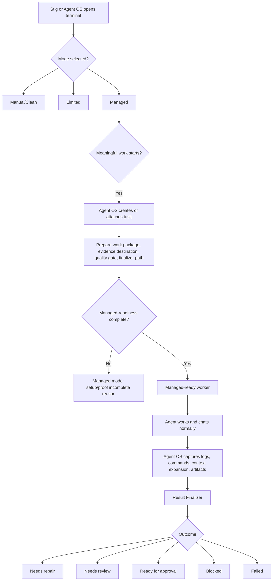

# 03 Managed Terminal Worker Model
## Source Files Merged
- `03 Managed Terminal Worker Model.md`

---

## Source 1: 03 Managed Terminal Worker Model.md

# 03 Managed Terminal Worker Model

## Core Idea

Agent OS should treat terminal panes as possible worker surfaces.

The terminal is where the AI agent works and where Stig may chat. Agent OS is the control layer that gives task context, records evidence, evaluates completion, and routes next steps.

## Product Statement

```text
Agent OS should let Stig keep chatting in terminals, while turning those terminals into managed task workers when attached to Agent OS.
```

## Terminal Modes

The system should distinguish two related things:

```text
terminal mode = what Stig or Agent OS intentionally opened
managed-readiness = whether backend proof/control is complete enough to trust the work result
```

| Mode | Who chooses it | Meaning | Backend promise |
| --- | --- | --- | --- |
| Manual/Clean terminal | Stig | Normal terminal chat. Not task-controlled. | No task/work package required. Useful for exploration. |
| Limited attached terminal | Stig or Agent OS | Terminal is attached/observed, but not full managed work. | Task/log/context may exist, but completion proof is limited. |
| Managed terminal worker | Stig or Agent OS | Terminal is intended for managed task work. | When meaningful work starts, Agent OS creates/attaches a task and prepares package/evidence/finalizer readiness. |
| Agent OS-launched worker | Agent OS | Agent OS starts worker from backend task/handoff. | Same managed requirements plus stronger launch/process control. |

## Why Modes Matter

Stig needs to know both what mode he opened and whether the backend has enough proof/control to trust the work result.

A manual/clean terminal may be useful, but it should not quietly become trusted completion proof.

A managed terminal should make this promise once meaningful work starts:

```text
Agent OS knows what task this terminal is working on.
Agent OS knows what package it received.
Agent OS knows what evidence is expected.
Agent OS can inspect the result.
```

## Managed Terminal Lifecycle



## Agent OS-Started Work

Path A:

```text
Task exists first.
Agent OS prepares work package.
Agent OS creates/opens worker terminal.
Terminal starts in managed mode from the beginning.
```

This is cleaner because Agent OS captures the full run from the start.

## Terminal-Started Work

Path B:

```text
Terminal exists first.
Stig starts chatting.
If the terminal is Managed mode and meaningful work starts, Agent OS creates or attaches a task automatically.
If Stig opened the terminal as Manual/Clean or Limited, that selected mode remains until Stig or Agent OS explicitly changes/attaches it.
```

This is necessary for Stig's real workflow.

Late attachment rule:

```text
Late attachment is allowed, but Agent OS should not pretend it captured earlier history unless it actually did.
```

If the terminal had uncaptured work before attachment, Agent OS can mark that portion as backfilled/limited. It must not retroactively treat uncaptured earlier chat as managed proof.

## One Active Terminal Per Task

Current Agent OS already has a one-active-terminal-per-task guard. Preserve this rule for managed terminal workers.

Reason:

```text
One active managed terminal per task keeps ownership clear and avoids two agents making conflicting edits under the same task.
```

Later, multi-worker orchestration can exist, but each worker should have clear role/session identity.

## Managed Mode And Managed-Readiness Requirements

A terminal can be in Managed mode because Stig or Agent OS opened it that way.

Managed work is ready/trusted only when these exist:

- backend task or attached task
- worker role
- durable work package
- evidence/result destination
- quality gate or verification expectation
- log/capture path
- result finalizer path
- backend status that confirms the above records are connected to the same task/run

If these are missing in a Managed terminal, keep the selected Managed mode visible but show setup/proof incomplete. Do not relabel Stig's chosen mode as Limited just because readiness is incomplete.

Implementation caution:

```text
Tracking a pane is not the same thing as managing worker completion.
Managed mode is the selected operating mode.
Managed-readiness/trusted result is the backend-confirmed package/evidence/finalizer state.
```

## Active Supervision

Managed workers should be watched while they run.

Agent OS should track, when possible:

- started successfully
- latest useful output or activity
- whether log/evidence capture is healthy
- whether the process/pane is still reachable
- whether the worker became silent/stuck beyond a configured limit
- whether Stig or the system cancelled the run

If the worker crashes, times out, becomes unreachable, or loses evidence capture, Agent OS should preserve what it has and explain the failure plainly.

## Local Retention And Cleanup

Full Warren/Burrow sandbox cleanup is later, but the baseline still needs local retention decisions.

For each managed run, Agent OS should know whether local artifacts/work area/logs are:

- retained for review
- retained for debugging after failure
- eligible for cleanup after approval

This can be metadata first. It does not require container sandboxing in the first version.

## What The Agent Experiences

The agent should experience the terminal as familiar:

```text
It can read files.
It can run commands.
It can talk to Stig.
It can repair failures.
```

But it receives clearer boundaries:

```text
Here is your task.
Here are suggested files.
Here are suggested tests.
Here are suggested commands.
Here is the quality gate.
Here is how completion will be judged.
```

## What Stig Experiences

Stig should not have to parse raw terminal logs to understand progress.

He should see:

- selected mode and readiness
- active task
- worker role
- work package status
- command/evidence status
- result outcome
- recommended next action

## Non-Goals

Do not implement these as first requirements unless already supported:

- forcing Stig to stop chatting in terminals
- overriding Stig's selected Manual/Clean or Limited mode and treating it as Managed without his choice
- blocking normal context file searching
- requiring GitHub PR delivery
- requiring container sandboxing before managed terminal control works
