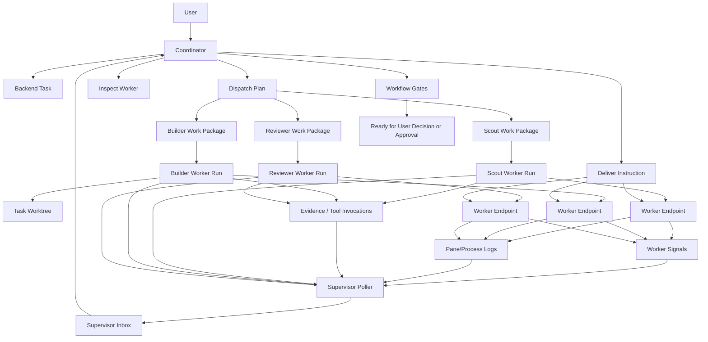
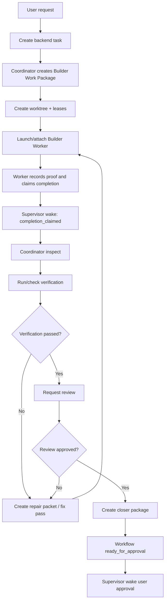
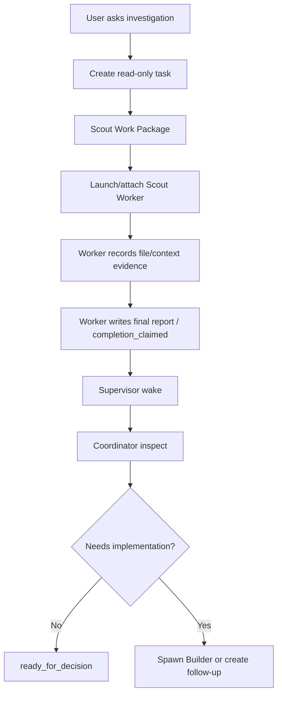

# Agent OS Supervisor Runtime - Detailed Implementation Plan

## 0. Intent

Implement a Firstmate-grade multi-agent supervision system inside Agent OS.

The goal is not to copy Firstmate's exact Bash/tmux/file implementation. The goal is to capture its technical essence and make it stronger using Agent OS's backend-first architecture.

The resulting system should let a main Coordinator manage multiple Workers automatically:

- create and route work.
- launch or attach Workers.
- give each Worker a durable Work Package.
- isolate implementation Workers in task worktrees.
- collect structured Worker Signals.
- automatically detect `done`, `blocked`, `needs_decision`, `failed`, stale, and ready states.
- queue actionable wakes durably.
- inspect Worker state without relying on raw chat history.
- deliver instructions or repair packets back to Workers.
- route through verification, review, closer, approval, and final decision gates.
- recover across app restarts and terminal closures.

Assume Firstmate has the best workflow ergonomics. Agent OS should match that workflow power, while using Agent OS records as the source of truth.

---

## 1. Naming model

Use the following names in Agent OS code, docs, and UI. Do not use Firstmate's nautical names.

| Concept | Agent OS name | Notes |
| --- | --- | --- |
| User-facing main agent | Coordinator | Receives the user request, splits work, routes Workers, handles escalations. |
| Worker agent/process | Worker | A task-scoped execution unit. Can be a PTY provider terminal, backend process, or future remote adapter. |
| Firstmate watcher | Supervisor Poller | Deterministic scanner/classifier, not an LLM. |
| Wake queue | Supervisor Inbox | Durable DB queue of actionable wakes. |
| Crewmate brief | Work Package | Durable context packet. Must be visible through `get_task` and runtime context. |
| Status file | Worker Signal | Structured status/event record. May be written via MCP, CLI, process adapter, or internal service. |
| Peek | Inspect | Bounded read of Worker state/logs/proof. |
| Send | Deliver Instruction | Persist and deliver a control message. |
| Session endpoint | Worker Endpoint | Desktop PTY, backend PTY, backend process, or future external endpoint. |
| Secondmate | Domain Coordinator | Persistent scoped coordinator. Defer until core Workers are stable. |

---

## 2. Target mental model



Plain language:

1. User asks the Coordinator for work.
2. Coordinator creates a backend task and one or more Worker assignments.
3. Each Worker gets a Work Package.
4. Implementation Workers get task worktrees.
5. Workers report through backend tools, Worker Signals, evidence, runtime transitions, reviews, and command records.
6. Supervisor Poller scans the records and endpoint health.
7. Actionable states go to the Supervisor Inbox.
8. Coordinator drains the inbox and decides whether to inspect, steer, ask the user, request review, route repair, or finish.

---

## 3. Current Agent OS foundation to reuse

The implementation must build on these Agent OS concepts rather than invent a parallel system.

### 3.1 Backend truth

Backend records remain lifecycle truth.

Do not treat terminal text, provider output, or UI state as final truth. Terminal logs can be evidence candidates, but accepted proof must be linked through backend records.

### 3.2 Runtime sessions/runs

Use `runtime_sessions`, `runtime_runs`, and `runtime_run_transitions` as the Worker lifecycle spine.

Each Worker should have a `runtime_run` with:

- `task_id`.
- `runtime_session_id`.
- `project_id`.
- `repository_id`.
- `role`.
- `provider`.
- `tracking_level`.
- `status`.
- `current_step`.
- `workspace_ref`.
- `pane_ref`.
- `pending_action_type` / `pending_action_ref` / `pending_action_delivery`.
- `trace_id`.
- `result_ref`.
- `failure_reason`.

### 3.3 Worktrees

Use `src/services/worktrees.ts` as the task worktree owner. Implementation Workers should use task worktrees when `requires_worktree` is true.

Do not let Workers edit the primary repository checkout for implementation work.

### 3.4 MCP tools and CLI fallbacks

Workers should use Agent OS MCP tools when possible. MCP is the preferred reporting/proof interface.

CLI fallbacks are acceptable but should record equivalent backend records.

### 3.5 Evidence and workflow gates

The Supervisor should never mark final task `done` simply because a Worker says it is done. A Worker can claim readiness. Agent OS workflow, verification, review, closer package, and approval services decide whether the task is ready for user approval or final completion.

### 3.6 Desktop PTY panes

Desktop-owned Codex/Claude panes are live Worker Endpoints, but Electron currently owns their PTY buffers and stdin. Backend inspection/control for these endpoints must go through an Electron IPC bridge or through flushed artifacts.

### 3.7 Process launchers

Backend controlled process launches are useful for contract-style Workers. They are not automatically the same as interactive Workers. Keep the endpoint types separate.

---

## 4. New source areas

Add these source folders to Agent OS:

```text
src/services/supervisor/
  wakeQueue.ts
  wakeClassifier.ts
  supervisorScan.ts
  workerSignals.ts
  workerInspection.ts
  workerControl.ts
  workerDispatch.ts
  supervisorTypes.ts

src/domain/supervisor/
  wakePolicy.ts
  workerSignalPolicy.ts
  endpointPolicy.ts

db/migrations/028_supervisor_runtime.sql

tests/supervisorWakeQueue.test.ts
tests/supervisorScan.test.ts
tests/workerSignals.test.ts
tests/workerControl.test.ts
tests/workerInspection.test.ts
```

Add CLI command group:

```text
src/cli/commands/supervisor.ts
```

Add MCP tools only after the DB/service core is implemented:

```text
src/mcp/tools/supervisor.ts
```

Add desktop IPC only when inspection/control is needed for live PTY panes:

```text
apps/desktop/electron/main.cjs
apps/desktop/electron/preload.cjs
apps/desktop/src/... supervisor UI models
```

---

## 5. Data model

### 5.1 Migration: `028_supervisor_runtime.sql`

Create a DB-backed Supervisor Inbox. This replaces Firstmate's local `state/.wake-queue`.

```sql
CREATE TABLE supervisor_wakes (
  id uuid PRIMARY KEY DEFAULT gen_random_uuid(),
  task_id uuid REFERENCES tasks(id) ON DELETE CASCADE,
  runtime_session_id uuid REFERENCES runtime_sessions(id) ON DELETE SET NULL,
  runtime_run_id uuid REFERENCES runtime_runs(id) ON DELETE CASCADE,
  wake_kind text NOT NULL,
  wake_key text NOT NULL,
  dedupe_key text NOT NULL,
  severity text NOT NULL DEFAULT 'normal'
    CHECK (severity IN ('info', 'normal', 'warning', 'critical')),
  status text NOT NULL DEFAULT 'queued'
    CHECK (status IN ('queued', 'drained', 'handling', 'handled', 'dismissed', 'superseded')),
  payload jsonb NOT NULL DEFAULT '{}'::jsonb
    CHECK (jsonb_typeof(payload) = 'object'),
  first_seen_at timestamptz NOT NULL DEFAULT now(),
  last_seen_at timestamptz NOT NULL DEFAULT now(),
  drained_at timestamptz,
  handling_started_at timestamptz,
  handled_at timestamptz,
  handled_by text,
  created_at timestamptz NOT NULL DEFAULT now(),
  updated_at timestamptz NOT NULL DEFAULT now()
);

CREATE UNIQUE INDEX supervisor_wakes_open_dedupe_idx
  ON supervisor_wakes(dedupe_key)
  WHERE status IN ('queued', 'drained', 'handling');

CREATE INDEX supervisor_wakes_task_idx
  ON supervisor_wakes(task_id, status, created_at);

CREATE INDEX supervisor_wakes_runtime_run_idx
  ON supervisor_wakes(runtime_run_id, status, created_at);

CREATE INDEX supervisor_wakes_status_idx
  ON supervisor_wakes(status, created_at);
```

### 5.2 Optional table: `worker_signals`

Add this if `task_events` and `runtime_run_transitions` are not enough. I recommend adding it because it gives Workers a clean equivalent of Firstmate's status lines without overloading task events.

```sql
CREATE TABLE worker_signals (
  id uuid PRIMARY KEY DEFAULT gen_random_uuid(),
  task_id uuid NOT NULL REFERENCES tasks(id) ON DELETE CASCADE,
  runtime_run_id uuid REFERENCES runtime_runs(id) ON DELETE SET NULL,
  runtime_session_id uuid REFERENCES runtime_sessions(id) ON DELETE SET NULL,
  signal_type text NOT NULL
    CHECK (signal_type IN (
      'working',
      'blocked',
      'needs_decision',
      'ready_for_review',
      'ready_for_approval',
      'completion_claimed',
      'failed',
      'heartbeat',
      'handoff_request',
      'repair_completed'
    )),
  summary text NOT NULL,
  payload jsonb NOT NULL DEFAULT '{}'::jsonb
    CHECK (jsonb_typeof(payload) = 'object'),
  source text NOT NULL DEFAULT 'worker',
  source_ref text,
  created_by text NOT NULL DEFAULT 'worker',
  created_at timestamptz NOT NULL DEFAULT now()
);

CREATE INDEX worker_signals_task_idx
  ON worker_signals(task_id, created_at);

CREATE INDEX worker_signals_runtime_run_idx
  ON worker_signals(runtime_run_id, created_at);
```

### 5.3 Optional table: `worker_control_messages`

Add this when implementing instruction delivery.

```sql
CREATE TABLE worker_control_messages (
  id uuid PRIMARY KEY DEFAULT gen_random_uuid(),
  task_id uuid NOT NULL REFERENCES tasks(id) ON DELETE CASCADE,
  runtime_run_id uuid REFERENCES runtime_runs(id) ON DELETE SET NULL,
  message_kind text NOT NULL
    CHECK (message_kind IN ('instruction', 'decision', 'repair_packet', 'stop', 'resume', 'clarification')),
  body text NOT NULL,
  payload jsonb NOT NULL DEFAULT '{}'::jsonb
    CHECK (jsonb_typeof(payload) = 'object'),
  status text NOT NULL DEFAULT 'queued'
    CHECK (status IN ('queued', 'delivered', 'acknowledged', 'failed', 'cancelled')),
  delivery_endpoint_type text,
  delivery_endpoint_ref text,
  delivered_at timestamptz,
  acknowledged_at timestamptz,
  failure_reason text,
  created_by text NOT NULL DEFAULT 'coordinator',
  created_at timestamptz NOT NULL DEFAULT now(),
  updated_at timestamptz NOT NULL DEFAULT now()
);
```

### 5.4 Runtime role constraint check

Before using `verifier` and `closer` as actual `runtime_runs.role` values, verify the active migration state. If the DB constraint only allows `coordinator`, `scout`, `builder`, and `reviewer`, add a migration to include `verifier` and `closer`.

---

## 6. Worker role model

Use these Worker roles:

| Role | Purpose | Writes code? | Requires worktree? | Typical outcome |
| --- | --- | --- | --- | --- |
| Coordinator | Main supervising role | No direct project edits | No | Dispatches and routes work. |
| Scout | Investigation/planning/audit/reproduction | No durable code shipping | Usually no, sometimes scratch | Report / recommendation / reproduction evidence. |
| Builder | Implementation | Yes | Yes | Patch, command evidence, verification request. |
| Reviewer | Review patch/evidence | No project writes | No or read-only | Approved / changes requested / blocked. |
| Verifier | Independent verification | No implementation writes | Optional read-only worktree | Verification run / evidence. |
| Closer | Package result for user approval | No | No | Closer package / ready state. |

First implementation should support Coordinator, Scout, Builder, and Reviewer. Add Verifier/Closer once role constraints and UI have been verified.

---

## 7. Worker lifecycle states

Runtime status is not enough by itself. The Supervisor should combine runtime status with Worker Signals and workflow state.

### 7.1 Worker Signal states

```text
working
blocked
needs_decision
ready_for_review
ready_for_approval
completion_claimed
failed
heartbeat
repair_completed
```

### 7.2 Supervisor states

```text
active
idle
stale
stuck
blocked
needs_decision
ready
failed
completed_claimed
review_ready
approval_ready
disconnected
capture_failed
inactive
```

### 7.3 State interpretation

| Signal / condition | Supervisor wake? | Why |
| --- | --- | --- |
| `working` | No, unless stale too long | Routine progress. |
| `heartbeat` | No | Keeps liveness fresh. |
| `blocked` | Yes | Coordinator/user may need to help. |
| `needs_decision` | Yes | User decision likely required. |
| `failed` | Yes | Coordinator must report or route fix. |
| `ready_for_review` | Yes | Coordinator should request/review. |
| `completion_claimed` | Yes | Coordinator should run finalizer/workflow. |
| Runtime process exit non-zero | Yes | Worker failed or disconnected. |
| Runtime process exit zero | Yes | Worker may be complete; inspect result. |
| No logs/evidence past threshold | Yes | Capture or worker may be stuck. |
| Stale active run | Yes after threshold | Firstmate-equivalent stale pane detection. |
| Workflow becomes `ready_for_approval` | Yes | User approval is needed. |
| Workflow becomes `ready_for_decision` | Yes | User decision is needed. |

---

## 8. Supervisor Inbox behavior

### 8.1 Insert or update, not spam

`enqueueWake()` should dedupe using a stable `dedupe_key`.

Examples:

```text
worker-signal:<runtime_run_id>:blocked
worker-signal:<runtime_run_id>:needs_decision
runtime-health:<runtime_run_id>:stale
workflow:<task_id>:ready_for_approval
review:<task_id>:changes_requested
verification:<task_id>:failed
```

If an open wake exists for the same `dedupe_key`, update `last_seen_at`, merge/replace payload, and keep the earliest `first_seen_at`.

### 8.2 Drain semantics

Implement the DB equivalent of Firstmate's atomic queue drain.

`drainWakes({ limit, coordinatorId })` should:

1. open a transaction.
2. select queued wakes ordered by severity/created time using `FOR UPDATE SKIP LOCKED`.
3. update selected records to `drained` or `handling`.
4. return them to the caller.
5. never lose records if the caller crashes before marking handled.

Recommended statuses:

```text
queued -> drained -> handling -> handled
queued -> dismissed
queued/drained/handling -> superseded
```

Add a requeue policy:

```text
handling wakes older than N minutes can be returned to queued
```

This is the DB version of Firstmate restoring the temp queue if drain fails.

### 8.3 CLI commands

Add:

```bash
agent-os supervisor scan
agent-os supervisor list [--task <id>] [--status queued]
agent-os supervisor drain [--limit 20]
agent-os supervisor handled <wake-id>
agent-os supervisor dismiss <wake-id> --reason "..."
agent-os supervisor requeue-stale-handling
```

---

## 9. Supervisor scan service

Add `src/services/supervisor/supervisorScan.ts`.

### 9.1 Inputs

Scan the following:

- active `runtime_runs`.
- `runtime_sessions`.
- latest `worker_signals`.
- `runtime_run_transitions`.
- `task_events`.
- `tool_invocations`.
- `command_runs`.
- `verification_runs`.
- `reviews`.
- `closer_packages`.
- `agent_launches` process status.
- `artifacts` with `provider_log` and runtime metadata.
- existing `evaluateManagedWorkerSupervision()` output.
- workflow stage from `calculateWorkflowStage()`.

### 9.2 Scan algorithm

Pseudo-code:

```ts
export async function scanSupervisor(pool, input) {
  const activeRuns = await listActiveRuntimeRuns(pool, input);
  const created: SupervisorWake[] = [];

  for (const run of activeRuns) {
    const task = run.task_id ? await getTask(pool, run.task_id) : null;
    const supervision = await evaluateManagedWorkerSupervision(pool, { runtimeRunId: run.id });
    const latestSignal = await getLatestWorkerSignal(pool, run.id);
    const workflow = task ? await calculateWorkflowStage(pool, task.id) : null;
    const process = await getLinkedProcessState(pool, run.id);
    const evidenceSummary = await summarizeRecentEvidence(pool, run.id);

    const wakeCandidates = classifyWakeCandidates({
      run,
      task,
      supervision,
      latestSignal,
      workflow,
      process,
      evidenceSummary,
    });

    for (const candidate of wakeCandidates) {
      created.push(await enqueueWake(pool, candidate));
    }
  }

  return { scanned: activeRuns.length, created };
}
```

### 9.3 Classifier examples

```ts
if (latestSignal.type === 'blocked') {
  enqueue worker_blocked;
}

if (latestSignal.type === 'needs_decision') {
  enqueue worker_needs_decision;
}

if (supervision.state === 'stale' || supervision.state === 'stuck') {
  enqueue worker_stale;
}

if (supervision.state === 'capture_failed') {
  enqueue worker_capture_failed;
}

if (workflow.stage === 'ready_for_approval') {
  enqueue task_ready_for_approval;
}

if (workflow.stage === 'ready_for_decision') {
  enqueue task_ready_for_decision;
}
```

### 9.4 Poller mode

Do not start with a long-running daemon. Start with CLI scan and desktop-triggered scan.

After core reliability is proven, add:

```bash
agent-os supervisor watch --interval 15
```

The watch mode should:

- use a DB advisory lock so only one poller runs per installation/project.
- call `scanSupervisor` repeatedly.
- emit logs but not require a UI.
- exit gracefully on SIGTERM.

---

## 10. Worker Signals

### 10.1 Add service

`src/services/supervisor/workerSignals.ts`

Functions:

```ts
createWorkerSignal(pool, {
  taskId,
  runtimeRunId,
  signalType,
  summary,
  payload,
  source,
  sourceRef,
  createdBy,
})

listWorkerSignals(pool, { taskId, runtimeRunId, limit })
getLatestWorkerSignal(pool, { runtimeRunId })
```

On create:

1. validate runtime/task consistency.
2. insert `worker_signals`.
3. record a `task_event`.
4. update `runtime_runs.current_step` for non-heartbeat signals.
5. enqueue a wake for actionable signals.

### 10.2 MCP tool: `report_status`

Add only after service tests pass.

Tool schema:

```json
{
  "signal_type": "working | blocked | needs_decision | ready_for_review | completion_claimed | failed | heartbeat | repair_completed",
  "summary": "short human-readable summary",
  "details": "optional longer details",
  "evidence_refs": ["optional IDs"],
  "next_action": "optional requested next action"
}
```

Rules:

- requires current managed task context.
- must link to current runtime run when available.
- cannot mark final task `done`.
- `completion_claimed` means Worker is done from its perspective; Coordinator/workflow must validate.
- `needs_decision` should create a Supervisor Wake with severity `warning`.
- `failed` should create a Supervisor Wake with severity `critical`.

### 10.3 CLI fallback

```bash
agent-os worker signal <task-id> \
  --runtime-run <id> \
  --type blocked \
  --summary "Need GitHub auth before PR creation."
```

---

## 11. Work Package design

The Work Package is Agent OS's equivalent of a Firstmate brief.

Use `context_packets` with labels like:

```text
worker-work-package-v1
managed-work-package-v1
worker-review-package-v1
worker-repair-package-v1
```

The Work Package must include:

```json
{
  "schema": "worker-work-package-v1",
  "worker_role": "builder",
  "task_id": "...",
  "runtime_run_id": "...",
  "objective": "Implement the login test fix.",
  "non_goals": [],
  "scope": {
    "project_id": "...",
    "repository_id": "...",
    "worktree_required": true,
    "allowed_paths": ["**"],
    "protected_paths": []
  },
  "status_protocol": {
    "preferred_tool": "report_status",
    "states": ["working", "blocked", "needs_decision", "completion_claimed", "failed"],
    "rule": "Report sparingly. Do not stream progress."
  },
  "proof_requirements": {
    "required": ["patch", "command_evidence", "verification", "review"],
    "terminal_text_is_not_proof": true
  },
  "completion_contract": {
    "worker_may_claim": "completion_claimed",
    "final_done_owner": "Agent OS workflow + user approval"
  },
  "instructions": [
    "Use Agent OS MCP tools first.",
    "Do not edit outside the worktree.",
    "Do not mark task done.",
    "Use request_review after proof is recorded."
  ]
}
```

The package should be available through:

- `get_task` continuation payload.
- `runtime context show --runtime-run <id> --label worker-work-package-v1`.
- startup context artifact.

---

## 12. Worker Endpoints

Agent OS needs two endpoint classes.

### 12.1 Interactive PTY Worker

Used for visible Codex/Claude panes or future backend PTYs.

Properties:

```text
endpoint_type = desktop_pty | backend_pty
workspace_ref
pane_ref
runtime_run_id
provider
status
last_buffer_sequence
last_log_artifact
```

Supports:

- inspect last N lines.
- deliver instruction by writing to stdin.
- close/cancel.
- record provider logs.
- recover by runtime records and artifacts.

### 12.2 Contract Process Worker

Used for automatic executor / Codex adapter / deterministic workers.

Properties:

```text
endpoint_type = contract_process
agent_launch_id
process_id
process_status
exit_code
log_artifact_path
result_artifact_path
```

Supports:

- inspect logs/result.
- no live steering unless adapter supports a control protocol.
- completion based on structured result contract.

### 12.3 Endpoint policy

Do not assume all Workers can be steered live.

| Endpoint | Inspect live? | Send live instruction? | Good for |
| --- | --- | --- | --- |
| Desktop PTY | Yes, via Electron | Yes, via Electron | Human-visible agent work. |
| Backend PTY | Yes, backend-owned | Yes | Future headless Firstmate-like workers. |
| Contract process | Logs/result only | Usually no | Deterministic auto execution. |
| External terminal | Maybe | Maybe | Future adapter. |

---

## 13. Inspect Worker implementation

### 13.1 Service

`src/services/supervisor/workerInspection.ts`

Function:

```ts
inspectWorker(pool, {
  runtimeRunId,
  lines = 80,
  includeEvidence = true,
  includeLogs = true,
})
```

Returns:

```ts
{
  runtimeRun,
  runtimeSession,
  task,
  supervision,
  latestSignal,
  workflowStage,
  endpoint: {
    type,
    status,
    workspaceRef,
    paneRef,
    provider,
    processId,
    exitCode,
  },
  terminalTail: string | null,
  recentLogs: ArtifactSummary[],
  recentEvidence: EvidenceSummary[],
  recentToolInvocations: ToolInvocationSummary[],
  recentCommandRuns: CommandRunSummary[],
  suggestedCoordinatorAction: string
}
```

### 13.2 Desktop PTY limitation

For desktop PTYs, the backend does not own the live buffer. Add Electron IPC:

```text
agent-os:terminal-inspect
```

Input:

```json
{
  "runtimeRunId": "...",
  "workspaceRef": "...",
  "paneRef": "...",
  "lines": 80
}
```

Output:

```json
{
  "ok": true,
  "data": {
    "terminalId": "...",
    "status": "running",
    "sequence": 123,
    "lastLines": "...",
    "exitCode": null,
    "lastFlushError": null
  }
}
```

Backend should still be able to inspect from artifacts if the live terminal is unavailable.

### 13.3 CLI

```bash
agent-os worker inspect --runtime-run <id> --lines 80
```

or under supervisor group:

```bash
agent-os supervisor inspect --runtime-run <id> --lines 80
```

---

## 14. Deliver Instruction implementation

### 14.1 Service

`src/services/supervisor/workerControl.ts`

Function:

```ts
createWorkerControlMessage(pool, {
  taskId,
  runtimeRunId,
  messageKind,
  body,
  payload,
  createdBy,
})
```

Then delivery:

```ts
deliverWorkerControlMessage(pool, {
  messageId,
  endpointType,
  endpointRef,
})
```

### 14.2 Delivery rules

- Always persist the control message before sending.
- Never send unrecorded instructions into a Worker endpoint.
- Use idempotency keys to avoid duplicate delivery.
- Mark delivery failed if endpoint is missing.
- Leave message queued if endpoint is temporarily unavailable.
- Worker should also see pending messages via `get_task` or `get_worker_instruction` so delivery is not lost if live PTY write fails.

### 14.3 Desktop delivery

Electron already can write to PTY. Wrap this as:

```text
agent-os:terminal-deliver-control-message
```

Input:

```json
{
  "messageId": "...",
  "runtimeRunId": "...",
  "body": "..."
}
```

Electron should:

1. find live terminal by runtime run id.
2. write formatted instruction to PTY.
3. call backend CLI to mark delivered.
4. return success/failure.

### 14.4 Message format inserted into terminal

Use a clear but non-fragile header:

```text

Agent OS Coordinator Instruction
Task: <task id>
Runtime run: <runtime run id>
Message: <body>

Acknowledge by calling report_status with working/blocked/needs_decision/completion_claimed.

```

Do not rely on invisible separators for V1. Keep it auditable.

---

## 15. Coordinator behavior

The Coordinator is the reasoning layer. It can be implemented first as instructions plus CLI/MCP flows, then later as an automatic loop.

### 15.1 Drain loop

The Coordinator should run:

```text
supervisor drain
for each wake:
  inspect if needed
  classify required action
  act or ask user
  mark wake handled
```

Pseudo-code:

```ts
async function coordinatorDrain(pool) {
  const wakes = await drainSupervisorWakes(pool, { limit: 20, handledBy: 'coordinator' });
  for (const wake of wakes) {
    const context = await buildWakeHandlingContext(pool, wake);
    const action = decideCoordinatorAction(context);
    await executeCoordinatorAction(pool, action);
    await markWakeHandled(pool, wake.id, { summary: action.summary });
  }
}
```

### 15.2 Coordinator actions

Possible actions:

```text
inspect_worker
ask_user_decision
report_ready_for_approval
request_review
create_fix_pass
send_instruction
mark_worker_blocked
launch_worker
cancel_worker
create_closer_package
dismiss_duplicate
```

### 15.3 Human boundaries

Coordinator may not:

- mark final implementation `done` without approval path.
- bypass validation contract.
- silently accept destructive/irreversible actions.
- treat Worker terminal text as proof.
- discard worktree changes without explicit discard approval.
- spawn a second active terminal for the same task.

---

## 16. Dispatch model

Firstmate can run many Workers in parallel. Agent OS should support the same, but with task/worktree/lease safety.

### 16.1 Dispatch profile concept

Add optional dispatch profiles later:

```json
{
  "rules": [
    {
      "when": "read-only investigation or log triage",
      "use": { "provider": "codex", "role": "scout", "model": "default", "reasoning": "medium" }
    },
    {
      "when": "implementation with test repair",
      "use": { "provider": "codex", "role": "builder", "reasoning": "high" }
    },
    {
      "when": "review or risk audit",
      "use": { "provider": "claude", "role": "reviewer" }
    }
  ],
  "default": { "provider": "codex", "role": "builder" }
}
```

This can live as backend configuration later, not local-only JSON at first.

### 16.2 Parallelism rules

Parallel Workers are allowed when:

- different tasks; or
- same task but different roles that do not edit the same files; or
- scout/reviewer/verifier read-only roles.

Serialize when:

- two Builders need overlapping edit leases.
- one Worker depends on another Worker result.
- same task already has an active terminal Worker and the new Worker would violate one-active-terminal-per-task rules.

### 16.3 File leases

For Builders, use edit leases. Do not just rely on prompt instructions.

---

## 17. Workflow integration

### 17.1 Implementation task path



### 17.2 Scout path



### 17.3 Review path

Reviewer Worker should not directly mark final approval. Reviewer records findings and review status. Coordinator/workflow routes the next step.

---

## 18. Safety and guardrails

### 18.1 Worktree guard

Before Builder Worker starts:

- task requires worktree.
- worktree exists.
- worker endpoint cwd is the worktree, not primary repo.
- Worker Work Package states the worktree path and branch.
- command evidence cwd source must be `worktree` for quality-gate commands when worktree is required.

### 18.2 Terminal proof boundary

Never let terminal text alone satisfy:

- command proof.
- verification proof.
- review proof.
- final approval.

Terminal logs can support investigation only.

### 18.3 One-active-terminal-per-task guard

Keep the existing guard. If implementing multiple Workers for one task, distinguish:

- user visible provider pane attached to task.
- backend process Worker.
- reviewer/scout read-only run.

If the current guard blocks legitimate multiple-role automation, do not simply remove it. Replace it with a stricter rule:

```text
one active interactive edit-capable Worker per task
many read-only/support Workers allowed if they have separate role/run records and no edit lease conflict
```

### 18.4 Control message audit

Every instruction delivered to a Worker must be recorded before delivery.

### 18.5 Wake dedupe

No noisy repeat pings. Repeated stale/blocked conditions should update an existing wake until handled or superseded.

### 18.6 Crash recovery

If Coordinator crashes after draining wakes, requeue stale `handling` wakes.

If desktop closes a pane, record runtime close and allow continuation.

If a worker endpoint disappears, Supervisor creates `worker_disconnected` wake.

If inspection fails, create `capture_failed` wake.

### 18.7 User approval boundary

Workers and Coordinator may reach `ready_for_approval`, not final `done`, unless Agent OS's existing approval path says final done is legal.

---

## 19. UI plan

Add Supervisor visibility in Desktop after backend pieces work.

### 19.1 Workspace pane header

Show:

```text
Worker role
Runtime run id short
Task binding
Supervisor state
Last signal
Capture health
Pending instruction count
```

### 19.2 Tasks view

Add Supervisor Inbox section:

```text
Needs Decision
Blocked Workers
Ready for Review
Ready for Approval
Stale/Disconnected Workers
```

### 19.3 Inspect panel

For selected Worker:

```text
Current step
Latest signal
Last terminal lines
Recent tool invocations
Recent command evidence
Recent artifacts
Workflow stage
Suggested Coordinator action
```

### 19.4 Control panel

Allow Coordinator/user to:

```text
Send instruction
Acknowledge blocked
Request more information
Continue same Worker
Start repair Worker
Cancel Worker
Inspect logs
```

All actions call backend services and record events.

---

## 20. CLI plan

Add supervisor commands:

```bash
agent-os supervisor scan
agent-os supervisor watch --interval 15
agent-os supervisor list --status queued
agent-os supervisor drain --limit 20
agent-os supervisor handled <wake-id> --summary "..."
agent-os supervisor dismiss <wake-id> --reason "..."
agent-os supervisor inspect --runtime-run <id> --lines 80
```

Add worker commands:

```bash
agent-os worker signal <task-id> --runtime-run <id> --type blocked --summary "..."
agent-os worker inspect --runtime-run <id>
agent-os worker message <runtime-run-id> --kind instruction --body "..."
agent-os worker deliver-message <message-id>
```

Keep CLI adapters thin over services.

---

## 21. MCP plan

Add these only after DB/services are stable.

### 21.1 `report_status`

Normal Worker-facing tool.

Purpose:

- report Worker Signal.
- replace firstmate status-file append.
- trigger Supervisor Wake for actionable states.

### 21.2 `get_worker_instruction`

Worker pull path for pending control messages.

Purpose:

- avoid losing instructions when live PTY write fails.
- let Workers call this after `get_task`.

### 21.3 `ack_worker_instruction`

Worker acknowledges a delivered instruction.

### 21.4 Avoid exposing admin controls

Do not expose Supervisor drain/dismiss/admin controls to normal Workers.

---

## 22. Testing plan

### 22.1 Unit tests

```text
supervisorWakeQueue.test.ts
  enqueue creates wake
  duplicate dedupe updates last_seen_at
  drain locks and marks drained
  handled closes wake
  stale handling wake requeues

workerSignals.test.ts
  report working does not create wake
  report blocked creates wake
  report needs_decision creates warning wake
  report failed creates critical wake
  completion_claimed creates wake but not task done

supervisorScan.test.ts
  stale managed worker creates stale wake
  capture_failed creates wake
  ready_for_approval workflow creates wake
  ready_for_decision workflow creates wake
  process exit creates wake
  repeated scan does not spam duplicate wakes

workerInspection.test.ts
  inspection includes runtime, task, latest signal, workflow, evidence summaries
  unavailable terminal returns artifact fallback and capture health

workerControl.test.ts
  control message persisted before delivery
  missing endpoint leaves queued
  successful delivery marks delivered
  duplicate delivery is idempotent
```

### 22.2 Integration tests

```text
managed Worker reports blocked -> wake appears -> drain returns wake -> mark handled
Builder claims completion -> workflow still not done -> verification/review required
Stale runtime with no provider logs -> capture_failed wake
Desktop close -> runtime close recorded -> worker disconnected wake
```

### 22.3 Desktop tests

```text
terminal inspect returns last N buffer lines
control message delivery writes to PTY and marks delivered
pane close preserves queued control messages
```

### 22.4 Regression tests

- final `done` cannot be set by Worker Signal.
- terminal text cannot satisfy verification proof.
- duplicate wakes are deduped.
- one active edit-capable Worker per task is enforced.
- read-only Workers do not get edit leases.

---

## 23. Rollout phases

### Phase 0 - Context and source alignment

- Add this design to Agent OS docs.
- Verify runtime role constraints.
- Decide if `worker_signals` table is included in V1.
- Remove/ignore local path committed files if needed before relying on bootstrap metadata.

Exit criteria:

- context docs updated.
- current branch constraints understood.
- implementation issue/task created.

### Phase 1 - Supervisor Inbox

- Add migration for `supervisor_wakes`.
- Add wake queue service.
- Add tests.
- Add CLI `supervisor list|drain|handled|dismiss`.

Exit criteria:

- DB-backed wake queue can dedupe, drain, requeue, and mark handled.

### Phase 2 - Passive Supervisor Scan

- Add `supervisorScan.ts`.
- Use existing managed worker supervision read model.
- Detect stale, stuck, capture_failed, disconnected, ready_for_approval, ready_for_decision.
- Add CLI `supervisor scan`.

Exit criteria:

- Running scan creates actionable wakes from existing runtime/workflow records.

### Phase 3 - Worker Signals

- Add `worker_signals` table and service.
- Add CLI `worker signal`.
- Create task events and wakes from actionable signals.
- Add tests.

Exit criteria:

- Worker status can be recorded without terminal parsing.

### Phase 4 - MCP status protocol

- Add `report_status` MCP tool.
- Update startup context and Work Package instructions to use it.
- Ensure tool invocation records link to task/runtime.

Exit criteria:

- Codex/Claude Worker can call MCP `report_status` and trigger Supervisor Inbox.

### Phase 5 - Inspect Worker

- Add backend inspection service.
- Add CLI inspect command.
- Add artifact/log fallback.
- Add Electron live-buffer inspect IPC for desktop PTYs.

Exit criteria:

- Coordinator can inspect Worker state like Firstmate `peek`, but with backend context.

### Phase 6 - Deliver Instruction

- Add `worker_control_messages` table/service.
- Add CLI create/list/deliver commands.
- Add Electron delivery IPC.
- Add Worker pull/ack tools if needed.

Exit criteria:

- Coordinator can send recorded instructions into live Worker endpoint or leave them queued.

### Phase 7 - Coordinator drain loop

- Add service/CLI to drain wakes and build handling context.
- Do not automate risky decisions yet.
- Start with summarizing recommended actions.

Exit criteria:

- User/Coordinator can run one command to see all actionable Worker states and next steps.

### Phase 8 - Parallel Worker dispatch

- Add dispatch service for multiple Workers.
- Support Scout + Builder + Reviewer sequencing.
- Respect leases and active endpoint constraints.
- Add dispatch profile later.

Exit criteria:

- One task can have managed multi-role workflow without losing truth/proof.

### Phase 9 - Desktop UI

- Add Supervisor Inbox view.
- Add Worker inspect panel.
- Add control message UI.
- Add status badges.

Exit criteria:

- User can see what the Coordinator sees.

### Phase 10 - Domain Coordinator

After Workers and Supervisor are stable, add persistent domain-scoped Coordinator records.

This maps Firstmate secondmates, but should be introduced only after core Worker orchestration is proven.

---

## 24. Definition of done for this feature

The feature is complete when Agent OS can:

1. Create a task.
2. Create a Worker Work Package.
3. Launch or attach a Worker endpoint.
4. Give the Worker a task worktree when needed.
5. Record Worker Signals through MCP or CLI.
6. Automatically detect actionable states through Supervisor Scan.
7. Queue wakes durably.
8. Drain wakes without loss.
9. Inspect Worker state from runtime records, logs, evidence, and terminal/process state.
10. Deliver recorded instructions back to a Worker endpoint.
11. Handle Worker blocked/failed/stale/done-claimed states without manual polling.
12. Keep final approval/done guarded by workflow and user approval rules.
13. Recover after app restart, process exit, pane close, and duplicate scans.
14. Prove behavior with tests.

---

## 25. Professional implementation guidance for the next agent

Start small. Do not try to build the whole fleet UI first.

Recommended first PR:

```text
028_supervisor_runtime.sql
src/services/supervisor/wakeQueue.ts
src/domain/supervisor/wakePolicy.ts
src/cli/commands/supervisor.ts
tests/supervisorWakeQueue.test.ts
context docs update
```

Second PR:

```text
src/services/supervisor/supervisorScan.ts
scan tests
CLI scan command
managedWorkerSupervision integration
```

Third PR:

```text
worker_signals migration/service
worker signal CLI
MCP report_status
startup/work package instruction updates
```

Only after those should the implementation touch live PTY control.

Reason: wake queue + scan + structured signals create the durable backbone. Live control is powerful but riskier, and it must sit on top of persisted records.
