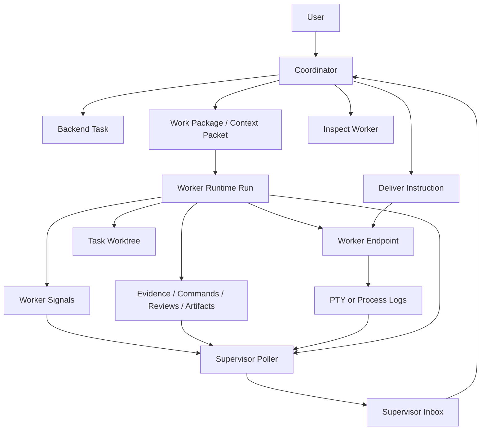

# Agent OS Supervisor Runtime Implementation Package

This folder contains the implementation plan for adding a Firstmate-style multi-agent supervision system to Agent OS, using Agent OS-native naming and architecture.

The plan assumes the Firstmate workflow is the functional benchmark: one main agent coordinates many worker agents, workers run in isolated execution spaces, workers report through structured signals, a watcher detects actionable changes automatically, wakes are queued durably, and the coordinator inspects, steers, reviews, escalates, merges, or tears down work without the user manually polling each worker.

Agent OS should not copy Firstmate's names or Bash-first implementation. Agent OS should capture the same operating model with its own backend-first architecture: Postgres lifecycle records, runtime sessions/runs, context packets, worktrees, leases, MCP tools, desktop PTY panes, process-launch contracts, evidence records, workflow gates, and approval boundaries.

## Proposed Agent OS names

| Firstmate term | Agent OS term | Meaning |
| --- | --- | --- |
| firstmate | Coordinator | The main supervising agent/service that receives user goals and routes work. |
| crewmate | Worker | A task-scoped agent/process/pane that performs investigation, implementation, review, verification, or closure. |
| secondmate | Domain Coordinator | A persistent scoped coordinator for a domain/project family. This is deferred until Worker supervision is stable. |
| brief | Work Package | Durable backend context packet describing the worker's mission, constraints, required proof, status protocol, and completion criteria. |
| status file | Worker Signal | Structured backend record or MCP submission that says `working`, `blocked`, `needs_decision`, `ready_for_review`, `completion_claimed`, or `failed`. |
| wake queue | Supervisor Inbox | Durable Postgres queue of actionable events for the Coordinator. |
| watcher | Supervisor Poller | Service/CLI loop that scans runtime runs, worker signals, tool invocations, evidence, terminal/process state, and workflow records. |
| peek | Inspect | Read bounded live/recorded worker state: runtime record, last terminal lines, recent evidence, logs, current step, and health. |
| send | Deliver Instruction | Persist a backend control message and deliver it to the worker endpoint through PTY stdin, process control channel, or pending-action packet. |
| tmux window | Worker Endpoint | Desktop PTY pane, backend PTY process, or controlled contract process. |
| treehouse worktree | Task Worktree | Agent OS-owned Git worktree under `.agent-os/worktrees`. |

## Files in this package

- [`IMPLEMENTATION_PLAN.md`](./IMPLEMENTATION_PLAN.md) - the detailed implementation plan, with phases, data model, services, CLI/MCP/UI changes, tests, safety rules, and rollout order.
- [`FIRSTMATE_CAPABILITY_COVERAGE.md`](./FIRSTMATE_CAPABILITY_COVERAGE.md) - a review checklist verifying that the plan captures the Firstmate workflow and maps each capability to an Agent OS-native equivalent.

## Core design principle

Agent OS should implement the workflow as a backend-native supervision plane:

The Coordinator is allowed to reason. The Supervisor Poller should be deterministic and low-cost. Workers should not need the user to manually ask whether they are done. The system should surface actionable states automatically.

## Non-goals

This package does not implement code directly. It is a technical implementation specification for another agent/developer to execute inside the Agent OS repository.

It also does not propose resurrecting Agent OS's removed managed `agent_turns` flow. The implementation should keep provider terminals as real provider terminals, while making backend records, worker signals, and supervisor wakes the source of truth.

## First implementation slice

The first professional slice should be small but durable:

1. Add a Postgres-backed Supervisor Inbox.
2. Add a deterministic supervisor scan service that reads active runtime runs and managed worker supervision state.
3. Add `agent-os supervisor scan|list|drain` CLI commands.
4. Add tests for dedupe, drain safety, stale worker detection, and readiness wakes.
5. Only after that, add worker status MCP tools and control-message delivery.

This makes the system observable and reliable before it becomes highly autonomous.
